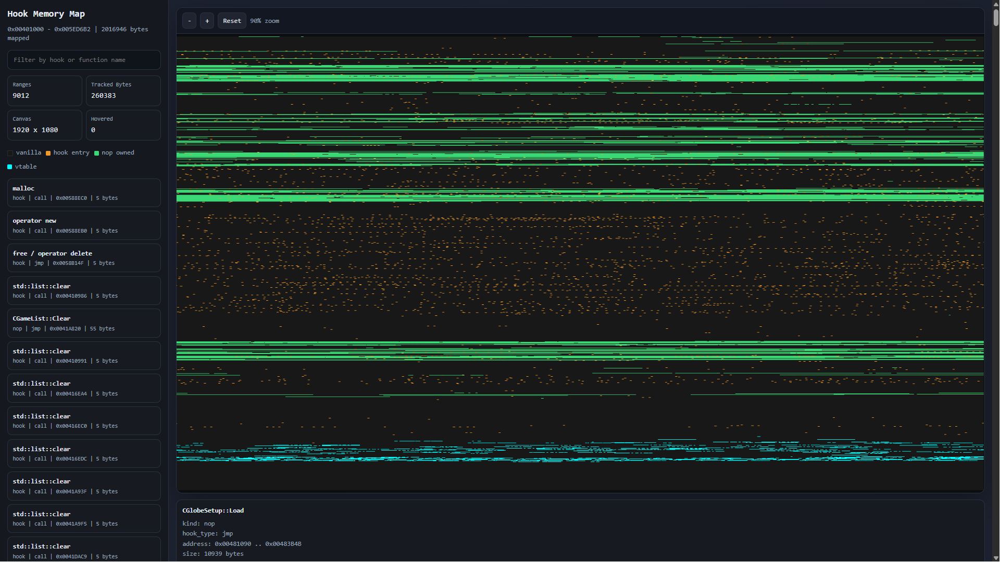

# HookModBase — Modular C++ DLL Modding SDK Template

[English](#english) | [Русский](#русский) | [Visual Showcase](#visual-showcase)

---

## English

**HookModBase** is a lightweight, structured C++ DLL template designed for reverse engineering, debugging, and game modding. 

Unlike raw hooking libraries, this project focuses on **software architecture**—providing a clean, object-oriented framework to organize multiple hook subsystems into modular classes rather than a cluttered single file.

---

### Reverse Engineering Workflow

This SDK bridges the gap between **Static Analysis** (IDA Pro) and **Dynamic Execution** (Injected DLL):

1.  **Inject DLL:** The DLL initializes and generates diagnostic files in the game folder.
2.  **Inspect Memory:** Open `hook_memory_map.html` to see exactly which code regions you've taken control over.
3.  **Sync IDA:** Run `ida_sync_map.py` in your IDA database. Your workspace will instantly reflect the DLL's changes (Orange = Hooks, Green = NOP Caves, Cyan = VTables).
4.  **Analyze Orphans:** Use the generated IDC script to find "Orphaned" functions (code blocks that are no longer called after your hooks), helping you find more space for code caves.

---

### Key Features

*   **Modular Architecture (`IHookModule` & `HookManager`):** Encourages clean code by separating mod features (e.g., `InputHook`, `GraphicsHook`) into isolated classes with standardized lifecycles.
*   **Safe Memory Rollback (`HookTracker`):** Automatically tracks overwritten bytes and restores original code in strict Last-In-First-Out (LIFO) order during DLL unloading, minimizing process crashes.
*   **IDA Pro Symbol Resolver (`SymbolResolver`):** Imports standard TAB-separated export lists from IDA Pro to automatically resolve raw virtual addresses to named functions in debug logs.
*   **Visual Tree Diagnostics:** Logs detailed hooking structure (with NOP-regions and parent call-sites) to `OutputDebugString` using tree-like graphics (`|-`, `\_`).
*   **Clean Memory Wrapper (`MemoryEx`):** Implements type-safe memory operations using `uintptr_t` to ensure compatibility across x86 and x64 platforms.
*   **Visual Memory Mapping (HTML/BMP/JSON):** Automatically generates an interactive, high-resolution map of the process memory. Visualize vanilla code, hook entries, NOP caves, and VTable overrides directly in your browser with zoom and tooltips.
*   **IDA Pro Live Sync (Python/IDC):** Generates synchronization scripts on the fly. Run them in IDA Pro to instantly colorize hooked functions, apply NOP patches, and add comments based on the live state of your DLL.
*   **Safe Huge-Log Support:** Completely rewritten logging engine using heap-allocated `std::string`. Safely handles massive `SymbolResolver` dumps (xrefs, trees) without risking game thread Stack Overflows.
---

### Technical Limits & Caveats

To keep the codebase lightweight and highly readable, the following design trade-offs were made:
1.  **No Length Disassembler Engine (LDE):** The SDK does not automatically calculate instruction lengths for inline hooks on the fly. The developer is responsible for specifying correct instruction bounds or filling remaining space with NOPs.
2.  **No Runtime Trampoline Generator:** The project is designed for complete function hijacking (replacement) or direct call-site patching. To call original functions inline, you must handle the assembly stub manually or integrate a low-level engine like *MinHook* or *Microsoft Detours* inside the `MemoryEx` implementation.

---

### Repository Structure

```text
├── HookModBase.sln                 # MSBuild Solution
├── HookModBase/                    # DLL Project (Dynamic Library)
│   ├── include/                    # SDK Header files
│   ├── src/                        # Core SDK Implementation
│   ├── example/                    # TestAppHook module implementation
│   └── dllmain.cpp                 # DLL entry point and thread setup
└── TargetApp/                      # Test EXE Project (Console Mock Engine)
    └── main.cpp                    # Hook target loop
```

---

### Quick Start

1.  Open `HookModBase.sln` in Visual Studio (configured for **Release | x86**).
2.  Build the solution.
3.  Navigate to the output directory containing:
   - TargetApp.exe
   - HookModBase.dll
   - ida_exports.txt (Input symbols)
   - hook_memory_map.html (Interactive view)
   - ida_sync_map.py / .idc (IDA Sync scripts)
4.  Run `TargetApp.exe`. You will see the original output for 2 frames, after which the background thread in the DLL successfully hooks the execution flow.

#### Creating a custom module:

```cpp
#include "IHookModule.h"
#include "MemoryEx.h"
#include "Utils.h"

class MyModModule : public IHookModule
{
public:
    const char* GetName() const override { return "MyModModule"; }

    bool Init() override {
        uintptr_t base = reinterpret_cast<uintptr_t>(GetModuleHandle(nullptr));
        
        // Setup an inline Jmp hook
        m_tracker.InstallHook(
            base + 0x1140, 
            HookType::Jmp, 
            reinterpret_cast<uintptr_t>(MyDetour), 
            "TargetClass::TargetMethod"
        );
        return true;
    }

    void Shutdown() override {
        m_tracker.RestoreAll(); // Safely rolls back changes
    }
};
```

---

## Русский

**HookModBase** — это легковесный, структурированный шаблон C++ DLL, разработанный для задач реверс-инжиниринга, отладки и создания игровых модификаций.

В отличие от низкоуровневых библиотек перехвата, этот проект сфокусирован на **архитектуре программного кода**. Он предоставляет объектно-ориентированную структуру для разделения различных подсистем хуков на изолированные модули, предотвращая накопление хаотичного кода в одной точке входа.

---

### Процесс реверс-инжиниринга

Этот SDK создает «мостик» между **Статическим анализом** (IDA Pro) и **Динамическим выполнением** (Инжектированная DLL):

1.  **Инжект DLL:** При запуске DLL инициализирует модули и создает диагностические файлы в папке игры.
2.  **Анализ карты:** Откройте `hook_memory_map.html`, чтобы увидеть, какие именно области кода вы взяли под контроль.
3.  **Синхронизация IDA:** Запустите `ida_sync_map.py` в вашей базе IDA. Рабочее пространство мгновенно окрасится: Оранжевый = Хуки, Зеленый = NOP-пещеры, Циановый = VTable.
4.  **Поиск «сирот»:** Используйте IDC-скрипт для поиска функций-сирот (блоков кода, на которые больше нет ссылок после ваших хуков), чтобы найти место под новые Code Caves.
---

### Ключевые возможности

*   **Модульная архитектура (`IHookModule` и `HookManager`):** Позволяет разносить функционал мода (например, работу с вводом `InputHook`, графикой `GraphicsHook`) по независимым классам со стандартизированным жизненным циклом.
*   **Безопасный откат памяти (`HookTracker`):** Автоматически отслеживает измененные байты и восстанавливает оригинальный код в строгом порядке LIFO (Last-In-First-Out) при выгрузке DLL, предотвращая падение целевого процесса.
*   **Разрешение символов IDA Pro (`SymbolResolver`):** Импортирует текстовые файлы экспорта функций из IDA Pro (разделенные табуляцией) для автоматического преобразования адресов памяти в осмысленные имена функций в логах отладки.
*   **Наглядная древовидная диагностика:** Выводит подробную структуру установленных хуков и затертых NOP-регионов в `OutputDebugString` в виде наглядного дерева с использованием символов псевдографики (`|-`, `\_`).
*   **Безопасная работа с памятью (`MemoryEx`):** Использует строго типизированные указатели `uintptr_t`, исключая срез адресов и обеспечивая переносимость кода.
*   **Визуальное картирование памяти (HTML/BMP/JSON):** Автоматически генерирует интерактивную карту памяти процесса. Позволяет видеть оригинальный код, точки входа хуков, NOP-пещеры и подмены VTable прямо в браузере с поддержкой зума и всплывающих подсказок.
*   **Синхронизация с IDA Pro (Python/IDC):** Генерирует готовые скрипты «на лету». Запустите их в IDA, чтобы мгновенно раскрасить базу, применить NOP-патчи и добавить комментарии, соответствующие реальному состоянию вашей DLL.
*   **Поддержка гигантских логов:** Полностью переработанный движок логирования с выделением памяти в куче (`std::string`). Безопасно обрабатывает огромные дампы от `SymbolResolver` (xrefs, деревья вызовов), исключая риск переполнения стека игровых потоков.
---

### Технические ограничения

Для сохранения простоты чтения и легковесности кода были приняты следующие архитектурные компромиссы:
1.  **Отсутствие дизассемблера длин (LDE):** Шаблон не вычисляет размер инструкций на лету. Разработчик должен самостоятельно контролировать границы изменяемых инструкций или забивать оставшееся место NOP-командами.
2.  **Отсутствие генератора трамплинов во время выполнения:** Проект ориентирован на полное замещение логики (hijacking) или патчинг адресов вызова (call-site). Для вызова оригинальной функции изнутри хука разработчику потребуется реализовать ассемблерный мост вручную или интегрировать решение класса *MinHook* / *Microsoft Detours* на уровне `MemoryEx`.

---

### Структура репозитория

```text
├── HookModBase.sln                 # Файл решения MSBuild (Visual Studio)
├── HookModBase/                    # Проект DLL (Динамическая библиотека)
│   ├── include/                    # Заголовочные файлы SDK
│   ├── src/                        # Исходный код ядра SDK
│   ├── example/                    # Реализация тестового модуля TestAppHook
│   └── dllmain.cpp                 # Точка входа DLL и запуск рабочего потока
└── TargetApp/                      # Тестовый проект EXE (Консольное приложение)
    └── main.cpp                    # Имитация игрового цикла
```

---

### Быстрый старт

1.  Откройте файл `HookModBase.sln` в Visual Studio (рекомендуется конфигурация **Release | x86**).
2.  Соберите решение (Build Solution).
3.  Перейдите в каталог сборки, содержащий:
   - TargetApp.exe
   - HookModBase.dll
   - ida_exports.txt (Входящие символы)
   - hook_memory_map.html (Интерактивная карта)
   - ida_sync_map.py / .idc (Скрипты синхронизации для IDA)
4.  Запустите `TargetApp.exe`. Первые два кадра выполнится оригинальный код, после чего фоновый поток DLL применит хуки и перехватит выполнение.

#### Пример создания собственного модуля:

```cpp
#include "IHookModule.h"
#include "MemoryEx.h"
#include "Utils.h"

class MyModModule : public IHookModule
{
public:
    const char* GetName() const override { return "MyModModule"; }

    bool Init() override {
        uintptr_t base = reinterpret_cast<uintptr_t>(GetModuleHandle(nullptr));
        
        // Установка стандартного inline-перехода (Jmp Hook)
        m_tracker.InstallHook(
            base + 0x1140, 
            HookType::Jmp, 
            reinterpret_cast<uintptr_t>(MyDetour), 
            "TargetClass::TargetMethod"
        );
        return true;
    }

    void Shutdown() override {
        m_tracker.RestoreAll(); // Безопасно восстанавливает оригинальные байты
    }
};
```

---

## visual-showcase
## 📊 Visual Showcase: Extreme Scale Instrumentation / Визуальный обзор: Инструментарий экстремального масштаба

> **Real-world stress test:** The image below demonstrates the framework managing a massive project with **9,000+ tracked ranges** and **260KB+ of injected code** within a 2MB executable area.
> **Реальный стресс-тест:** На изображении ниже показана работа фреймворка в крупном проекте: **9,000+ отслеживаемых диапазонов** и **260КБ+ инжектированного кода** в области памяти размером 2МБ.

<p align="center">
  
</p>

### 🔍 Deep Analysis / Глубокий анализ:

*   **9012 Ranges / 9012 Диапазонов:** Proof of a highly optimized management system. The framework overhead remains negligible even when tracking thousands of individual hooks and NOP-caves.
    *(Доказательство оптимизированной системы управления. Накладные расходы фреймворка остаются ничтожными даже при отслеживании тысяч отдельных хуков и NOP-пещер).*
*   **Total Control / Полный контроль:** The sidebar shows hooks on low-level system functions (`malloc`, `operator new`, `free`) alongside complex engine logic (`CGamelist::Clear`).
    *(Боковая панель демонстрирует перехват как системных функций низкого уровня, так и сложной логики движка).*
*   **Visual Legend / Визуальные обозначения:**
	*   <kbd>🟠</kbd> **Orange (Hook Entry):** Points where the execution flow is intercepted. Note the dense "starry sky" clusters in the code section.
        *(Оранжевый: Точки перехвата потока выполнения. Обратите внимание на плотные кластеры в секции кода).*
    *   <kbd>🟢</kbd> **Green (NOP Owned):** Full functions replaced by custom logic. These are reclaimed "code caves" fully controlled by the SDK.
        *(Зеленый: Функции, полностью замененные кастомной логикой. Это «пещеры кода», перешедшие под полный контроль SDK).*
    *   <kbd>🔵</kbd> **Cyan (VTable):** Redirected virtual method slots, ensuring OOP-level architectural consistency.
        *(Бирюзовый: Перенаправленные слоты виртуальных методов, обеспечивающие архитектурную целостность на уровне ООП).*

---

### 🛠 From Data to Action / От данных к действию
The data visualized above is the **exact same data** used to generate IDA Pro synchronization scripts. This ensures that your static analysis (IDA) and dynamic environment (In-game) are always in 1:1 perfect sync, no matter how many thousands of hooks you deploy.

Данные, которые вы видите на карте — это **те же самые данные**, которые используются для генерации скриптов синхронизации IDA Pro. Это гарантирует, что ваш статический анализ (IDA) и динамическая среда (в игре) всегда синхронизированы 1 к 1, сколько бы тысяч хуков вы ни использовали.